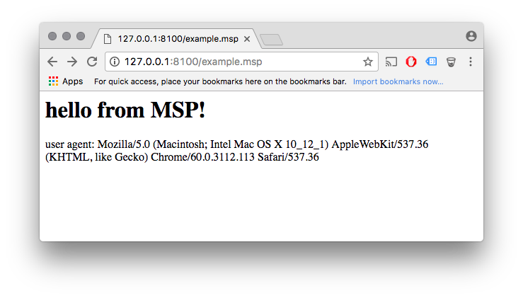

# Server side scripting example

This example shows how to implement simple server-side
scripting engine with
[Mongoose](https://github.com/cesanta/mongoose) and
[mJS](https://github.com/cesanta/mjs)

This example starts HTTP server on port 8100. Files with
`.msp` extension are treated specially: they are HTML files with
`{{ ...mJS_code_here... }}` snippets inside.


It works like PHP and alike. Each requests initialises a scripting instance, which executes code within `{{ }}` blocks. Your application create an API
that is available to the scripting engine. This example defines a function
`send(some_string)` which appends a string data to the HTML flow. Also,
mJS FFI API is available which allows to call your applications'
C functions directly.

### How to run this example

To try this out, do (assuming unix/mac ): 

```
git clone https://github.com/cpq/lm
cd lm
git submodule update --init
make
./lm
```

Then start your browser on port 8100, navigate to `example.msp`:



### Contact

https://mongoose-os.com/contact.html
